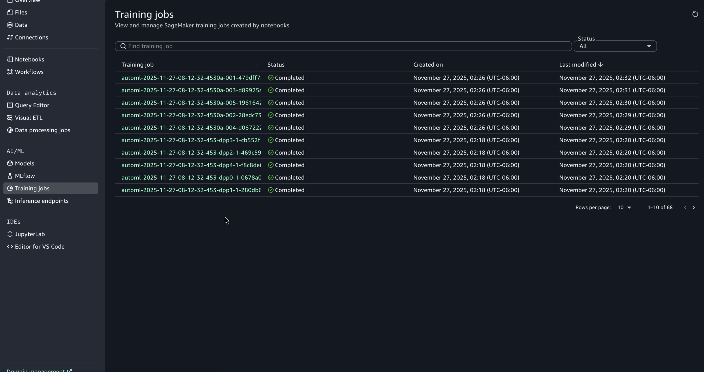
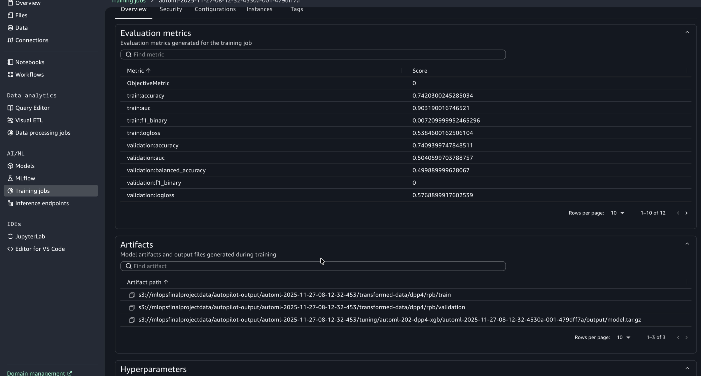
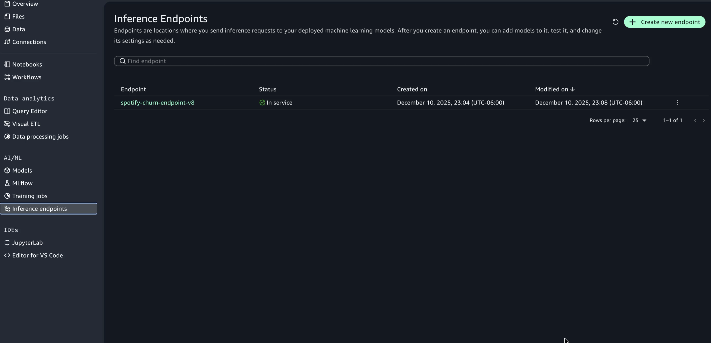
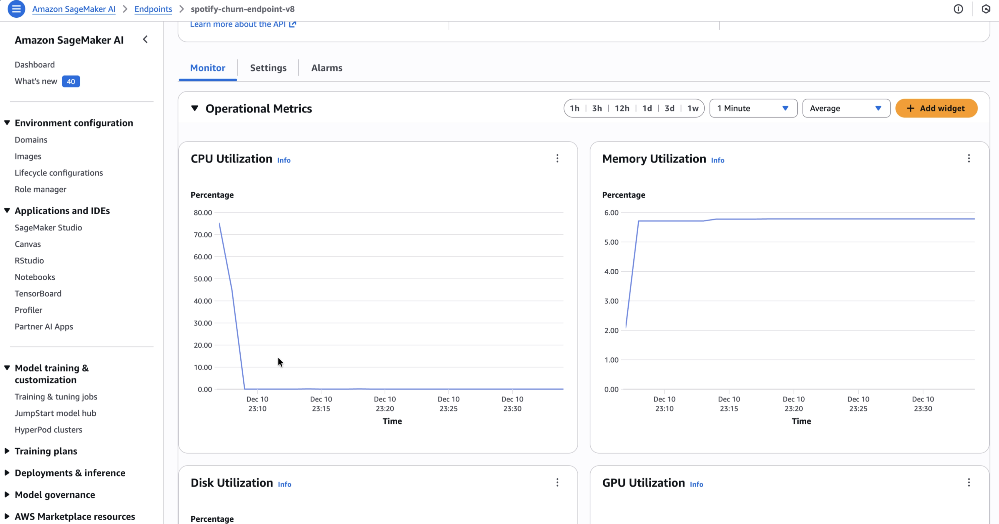
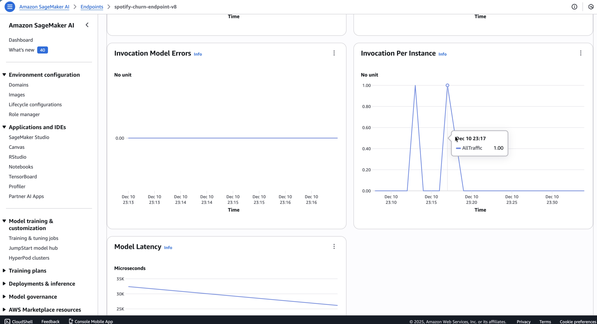

# Spotify Churn Prediction – End-to-End MLOps Pipeline

This project demonstrates a complete **MLOps pipeline** on AWS SageMaker for predicting Spotify user churn. It leverages **SageMaker Pipelines** for orchestration, **FLAML (AutoML)** for model selection, **Model Registry** for versioning, and **Model Monitor** for drift detection.

The entire workflow is implemented in a single notebook: `full_pipeline.ipynb`.

---

## 🚀 Project Architecture

The pipeline follows a production-ready MLOps architecture:

1.  **Data Ingestion**: Load raw data from Amazon S3.
2.  **Preprocessing (ProcessingStep)**: Clean and one-hot encode features using a `ScriptProcessor` (ml.t3.medium).
3.  **Model Training (TrainingStep)**: Train a classifier using **FLAML AutoML** to automatically select the best algorithm (XGBoost, LightGBM, etc.) and hyperparameters.
4.  **Model Registration**: Register the trained model in the **SageMaker Model Registry** with versioning and metrics (F1, Accuracy, ROC-AUC).
5.  **Deployment**: Deploy the model to a real-time **SageMaker Endpoint** with Data Capture enabled.
6.  **Monitoring**: Establish a baseline and monitor the endpoint for **Data Drift** using SageMaker Model Monitor.

---

## 📋 Assignment Requirements Checklist

This project fulfills all the following requirements:

- [x] **Dataset with outcome variable**: Spotify user churn dataset (`is_churned`).
- [x] **Train/Test split**: Pre-split data stored in S3 (`train.csv`, `test.csv`).
- [x] **Evaluation metric**: F1 Score, Accuracy, ROC AUC.
- [x] **ML Pipeline**: Implemented using **SageMaker Pipelines** SDK.
- [x] **Model deployment**: Real-time REST API endpoint deployed on `ml.m5.large`.
- [x] **Model monitoring**: Data Capture enabled (100%) and Drift Detection configured.
- [x] **Test data validation**: Evaluated on original test set.
- [x] **Modified features test**: Simulated drift by modifying `listening_time` (+50%) and `skip_rate` (+0.05).
- [x] **Demo-ready**: All steps contained in `full_pipeline.ipynb` for easy demonstration.

---

## 📂 Repository Structure

- **`full_pipeline.ipynb`**: **MAIN FILE**. Contains the entire end-to-end workflow (Steps 0-15).
- `train_sagemaker.py`: Training script generated by the notebook (uses FLAML).
- `preprocess.py`: Preprocessing script generated by the notebook.
- `inference.py`: Custom inference script for the deployed endpoint.
- `requirements.txt`: Dependencies for the training job.
- `images/`: Folder for screenshots (Pipeline graph, UI metrics, etc.).

---

## 📸 Screenshots & Evidence

### 1. Training Jobs
Overview of the AutoML training jobs executed by the pipeline.

### 2. Model Evaluation Metrics
Metrics (F1, Accuracy, ROC-AUC) calculated during the pipeline execution.

### 3. Deployed Endpoint
The active real-time inference endpoint.

### 4. Monitoring & Metrics
Operational and invocation metrics from the deployed endpoint.

---

## 🛠️ How to Run

1.  **Open `full_pipeline.ipynb`** in SageMaker Studio or a Jupyter environment.
2.  **Run Step 0 & 1** to install dependencies and configure the S3 bucket/role.
3.  **Run Steps 2-4** to explore data and run a standalone training job (optional but recommended).
4.  **Run Step 5** to build and execute the **SageMaker Pipeline**.
5.  **Run Step 5.5** to register the model in the Model Registry.
6.  **Run Step 6-8** to create the inference script and **deploy the endpoint**.
7.  **Run Step 9-14** to set up monitoring, send test traffic, and analyze drift.
8.  **Run Step 15** to delete the endpoint and clean up resources.

---

## 📊 Key Metrics

The pipeline automatically tracks the following metrics in SageMaker Experiments/Training Jobs:
- **F1 Score**
- **Accuracy**
- **ROC AUC**
- **Precision / Recall** (available in logs)

---

## 🧹 Cleanup

To avoid AWS charges, always run **Step 15** in the notebook to delete the real-time endpoint after testing.